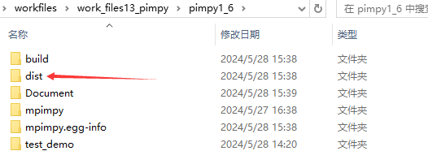
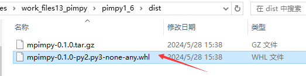
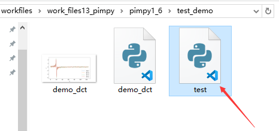
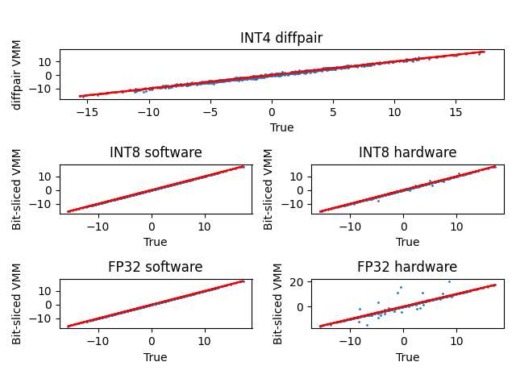
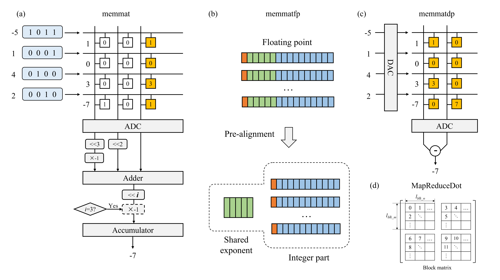
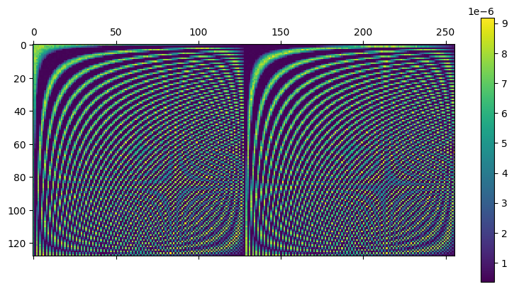
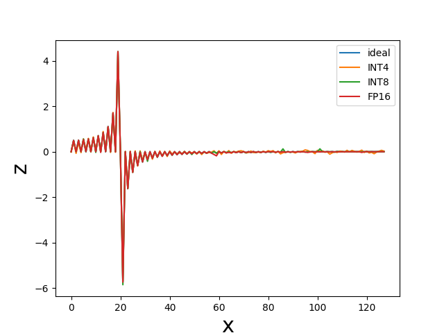

# mPimPy: A Software-Hardware Co-Design Simulator for Memristor-Based In-Memory Computing

*Author: Ling Yang*

*Maintainer: Researchers from Prof. Xiangshui Miao and Prof. Yi Li's group at HUST*

*Email: 3299285328@qq.com*

*Huazhong University of Science and Technology, School of Integrated Circuit*

## 0. Make in-memory computing as easy as np.dot !

In memory computing technology is a potential solution to overcome the von Neumann bottleneck and to provide significant improvements in energy efficiency. However, for in-memory computing, the algorithm and hardware are highly intertwined, making it challenging to design an optimal circuit. To address this issue, the author developed a Python package named "mPimPy" that embeds hardware simulation into the algorithm. From a user's perspective, mPimPy serves as the equivalent of the Numpy.dot function to implement the matrix multiplication which is the key operation of neural networks, machine learning, signal processing, and scientific computing. By simply replacing the `np.dot` function in your original code with `MapReducedot` and rerunning your program, you can simulate scenarios such as neural networks or any algorithm involving matrix multiplications. Whether you are a computer engineer or a microelectronic scientist, mPimPy enables you to quickly deploy your code on in-memory computing hardware or verify your circuit design solutions.

## 1. Installing

### 1.1 Offline

Find the folder named *dist*, as shown in Figure 1：



Open the folder and find the wheel file with a suffix of *whl*, as shown in Figure 2: 



Copy the file path and open the terminal to install the mPimPy：

```shell
activate your_env_name
pip install your_path\mpimpy-0.1.0-py2.py3-none-any.whl 
```

`your_env_name` is the python environment where mPimPy needs to be installed， and `your_path` is the path of the wheel file.

### 1.2 Online

Open the terminal, and type in:

```shell
pip install mpimpy
```

After installing finished, Open the *test.py* file in the *test_demo* folder, as shown in Figure 3：



Run the test.py, if the obtained result is as illustrated in Figure 4, mPimPy is installed successfully. 



## 2. Instruction of mPimPy

### 2.1 Contents

The mPimPy package incorporates three simulation function modules: `memmat`, `memmatfp`, and `memmatdp`. The first two utilize a bit-slicing strategy, while the memmatdp module is implemented based on the differential pair method. The key distinction between them is that memmat and memmatdp employ signed fixed-point quantization to preprocess data before mapping. Regardless of whether the original data is fixed-point or floating-point, it is uniformly quantized into a specified bit-width signed integer. Conversely, memmatfp handles floating-point numbers and preprocesses them through block pre-alignment, converting these numbers into pseudo-floating point numbers with separate exponent and mantissa, as depicted in Figure 5. All modules come equipped with numerical restoration functions, converting all computation results back to FP64 floating-point numbers. Additionally, the operand matrix is divided into several block matrices to accommodate the array size, as illustrated in Figure 5(d).



### 2.2 Tutorial

Step 1: import necessary packages. 

```python
import numpy as np              
import matplotlib.pyplot as plt 
from mpimpy import memmatdp      # differantial pair 
from mpimpy import memmat        # Integer quantum module 
from mpimpy import memmatfp      # Pre-alignment for floating-point number
```

Step 2：generate virtural chips.

```python
dpe_dp = memmatdp.diffpairdpe(HGS=1e-5, LGS=1e-7, g_level=16, var=0.05, vnoise = 0, wire_resistance=2.93,
                            rdac=256, radc=1024, vread=0.1, array_size=(32, 32))

dpe_int = memmat.bitslicedpe(HGS=1/1.3e5, LGS=1/2.1e6, g_level=16, var=0.27, vnoise = 0, wire_resistance=2.93, 
                             rdac=256, radc=256, vread=0.1, array_size=(32, 32))

dpe_fp = memmatfp.fpmemdpe(HGS=1e-5, LGS=1e-7, g_level=16, var=0.05, vnoise = 0, wire_resistance=2.93,
                            rdac=256, radc=1024, vread=0.1, array_size=(32, 32))
```

**Parameters：**

| Parameter         | Full name                                | Default value  | Range of value                                                            |
| ----------------- |:---------------------------------------- | -------------- | ------------------------------------------------------------------------- |
| `HGS`             | High conductance state                   | $10^{-5}$      | > LGS                                                                     |
| `LGS`             | Low conductance state                    | $10^{-7}$      | > 0                                                                       |
| `g_level`         | Number of the conductance states         | 16             | $\geq2$                                                                   |
| `var`             | Conductance variability of the memristor | 0.1            | $\geq 0$                                                                  |
| `vnoise`          | Noise on inputed voltage                 | 0.05           | $\geq 0$                                                                  |
| `wire_resistance` | Wire resistance                          | 2.93 (@22 nm)  | $\geq 0$                                                                  |
| `rdac`            | Precision of DAC                         | 256 (8 bits)   | $2^n,(n\geq1)$                                                            |
| `radc`            | Precision of ADC                         | 1024 (10 bits) | $2^n,(n\geq1)$                                                            |
| `vread`           | Read voltage                             | 0.1 V          | Choose an appropriate operating voltage according to the used real device |
| `array_size`      | array size or block size                 | $32 \times 32$ | Choose the size according to the used array                               |

Step 3：perform the matrix multiplication

```python
a = np.random.randn(32, 32)
b = np.random.randn(32, 32)
c_true = np.dot(a, b)            # ideal value
```

There are five functions for matrix multiplication：

```python
# Perform the hardware simulation for integer format based on differential pair method
c_df_hardware = dpe_dp.MapReduceDot(a, b)  

# Implemented with full software at integer format based on bit-slicing strategy
c_int_software = dpe_int.BitSliceVMM(a, b, 
                 xblk=[1,1,2,4], mblk=[1,1,2,4])

# Perform the hardware simulation for integer format based on bit-slicing strategy
c_int_hardware = dpe_int.MapReduceDot(a, b, 
                 xblk=[1,1,2,4], mblk=[1,1,2,4], wire_factor=False)  

# Implemented with full software at pre-alignment case
c_fp_software = dpe_fp.fpvmm(a,b, 
                xblk=[1 for i in range(23)], mblk=[1 for i in range(23)], bw_e=8)

# Perform the hardware simulation for pseudo-floating point matrix
c_fp_hardware = dpe_fp.MapReduceDot(a, b, 
                xblk=[1 for i in range(23)], mblk=[1 for i in range(23)], bw_e=8)  
```

Parameters：

- `a`：ndarray, left product matrix. Matrix a will be mapped into the voltages in the function MapReduceDot. 

- `b`：ndarray, right product matrix. Matrix a will be mapped into the conductances in the function MapReduceDot.  Therefore, be very careful when performing simulation that there is a difference in the location of a and b on the hardware. If the original formulation is in a vector-matrix multiplication case, you can use the transpose strategy to perform the mapping. 

- `xblk`：integer list, xblk defines the slicing rule for the left product matrix a, where the first element represents the bit width of the signed bit, so it must be 1；

- `mblk`：integer list, mblk defines the slicing rule for the right product matrix a. The usage is the same as paramter xblk. 

- `wire_factor`：bool. When wire_factor is `True`, it indicates that the simulation is implemented with taking into account the wire resistance. Generally, wire resistance is below  $5~\Omega$ . Therefore, when the low resistance state of the used device is over $100~\Omega$ ，and the array size is below $128 \times 128$ , the influence from the wire resistance is slight. 

- `bw_e`：int，bit width of the shared exponent. The parameter exists in the memmatfp module only. 

It's important to note that the multiplication rule under the bit-splitting method is completely consistent with binary multiplication, using the complement for calculation, so the weight of the sign bit is negative. When bit-splitting, it is forced to map to 1 bit, and the mapping of other data bits cannot exceed the conductance state number `g_level` of the memristor itself, that is, $2^{bitwidth} \leqslant$ `g_level`. The slice rule must be given by the parameters of `xblk` and `mblk`. For the fixed-point quantization of memmat, the sign bit is forced to be 1. For memmatfp, only the slice rule for mantissas can be defined by the user, while the signed bit and integer bit are mapped with the 1-bit device for robustness.

### 2.3 Example

Discrete cosine transform (DCT), one of the most important orthogonal transformations, is the core of the image compression algorithm of jpg. Herein, as a case of study, we demonstrate the simulation process of DCT. 

For 1-dimension DCT, it can be expressed as: 

$y(k)=w(k)\sum\limits^n\limits_{i=1}{x(n)\cos{(\frac{\pi}{2N}{(2n-1)(k-1)})}}, k=1,2,...,N$

where：

$w(k)=\begin{cases} \frac{1}{\sqrt{N}}, k=1 \\ \sqrt{\frac{2}{N}}, 2\leq k \leq N \end{cases}$

The above equation also can be expressed as a matrix operation：

$\textit{\textbf{y}}=\textit{\textbf{x}}\textit{\textbf{M}}_{\textnormal{dct}}$

Next, we perform the in-memory computing simulation for 1-d DCT with mPimPy：

```python
import numpy as np
from mpimpy import memmat
from mpimpy import memmatdp
from mpimpy import memmatfp

def cosine_m(sca):
    A = np.zeros([sca,sca])
    for i in range(sca):
        for j in range(sca):
            if(i == 0):
                x = np.sqrt(1/sca)
            else:
                x = np.sqrt(2/sca)
            A[i][j] = x*np.cos(np.pi*(j+0.5)*i/sca)

    return A

dct_m = cosine_m(128)          # Generate the DCT matrix 
x = np.linspace(0, 10, 128)    
y = np.sin(2*np.pi*x)          # Input signal 

z = np.dot(dct_m, y)           # Ideal output

# Generate the chips and set the key parameters
dpe_int = memmat.bitslicedpe(HGS=1/1.3e5, LGS=1/2.23e6, g_level=16, var=0.05, vnoise = 0, wire_resistance=2.93, 
                             rdac=256, radc=256, vread=0.1, array_size=(32, 32))

dpe_dp = memmatdp.diffpairdpe(HGS=1/1.3e5, LGS=1/2.23e6, g_level=16, var=0.05, vnoise = 0, wire_resistance=2.93,
                            rdac=256, radc=1024, vread=0.1, array_size=(32, 32))

dpe_fp = memmatfp.fpmemdpe(HGS=1/1.3e5, LGS=1/2.23e6, g_level=16, var=0.05, vnoise = 0, wire_resistance=2.93,
                            rdac=256, radc=1024, vread=0.1, array_size=(32, 32))

# Perform the DCT with hardware
z_int4 = (dpe_dp.MapReduceDot(y, dct_m.T)).T
z_int8 = (dpe_int.MapReduceDot(y, dct_m.T, xblk=[1 for i in range(8)], mblk=[1 for i in range(8)])).T
z_fp16 = (dpe_fp.MapReduceDot(y, dct_m.T, xblk=[1 for i in range(10)], mblk=[1 for i in range(10)])).TFinally, plot the results obtained with different computing conditions：
```

```python
import matplotlib.pyplot as plt
#plot the conductance matrix mapped with diffpairdpe
plt.matshow((dpe_dp.Num2R(dct_m)).T)    
plt.colorbar()
plt.show()
```



```python
plt.plot(z)
plt.plot(z_int4)
plt.plot(z_int8)
plt.plot(z_fp16)
plt.legend(['ideal', 'INT4', 'INT8', 'FP16'])
plt.show()
```



### 2.4 Precautions

1. It's advisable to set the simulation parameters in line with real devices and circuits. When conducting simulations, careful consideration should be given to non-ideal factors, such as device conductance variability and the quantization noise introduced by DAC and ADC.

2. In in-memory computing circuits, energy consumption and chip area are largely dominated by the ADC. There exists a trade-off between precision and performance.

3. The memmatfp module offers a flexible pseudo-floating point computing method where the exponent and mantissa are separated, allowing users to define the bit width of these two parts. Here, we present the composition of several commonly used floating point numbers: 
   
   | FP type | Exponent  width | Mantissa width | Effective data width after pre-alignment |
   | ------- | --------------- | -------------- |:---------------------------------------- |
   | FP16    | 5               | 10             | 12                                       |
   | FP32    | 8               | 23             | 25                                       |
   | FP64    | 11              | 52             | 54                                       |
   | BF16    | 8               | 7              | 9                                        |

## 3. Notes

Any advice and criticism are highly appreciated on this package. Naturally, you can also modify the source code to suit your needs. In upcoming versions, we plan to continually incorporate the latest research findings into mPimPy. Stay tuned!

## References

[1]    [Zidan M A, Jeong Y J, Lee J, et al. A general memristor-based partial differential equation solver[J]. Nature Electronics, 2018, 1(7): 411-420.](https://www.nature.com/articles/s41928-018-0100-6)

[2]     [Li C, Hu M, Li Y, et al. Analogue signal and image processing with large
 memristor crossbars[J]. Nature electronics, 2018, 1(1): 52-59.](https://www.nature.com/articles/s41928-017-0002-z)
